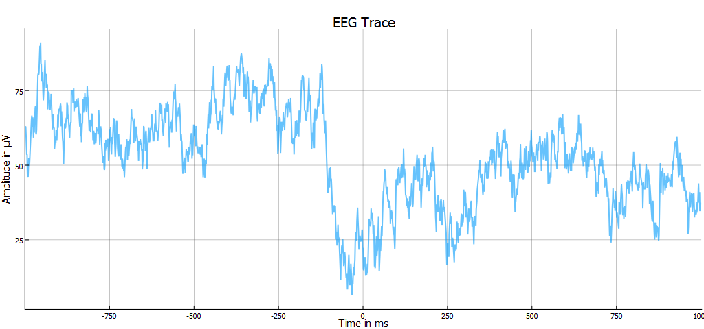

# brainvisionloader
Loads raw brainvision data into Julia

The magic happens in

readBrainVision.jl

Check out script.jl to see how to read & plot the exemplary dataset

```julia
filename = "./data/example"
EEG, DataInfo, ChanInfo = readEEG(filename)


y = EEG[25,1:10*get(DataInfo,"SamplingRate",1000)];
x = 1:length(y);

plot(x, y,
    linewidth=2,
    alpha=0.6,
    title="EEG Trace",
    legend=:none,
    xlabel = "Time in ms",
    ylabel = "Amplitude in μV",
    size = (1024,480),
    );
```


